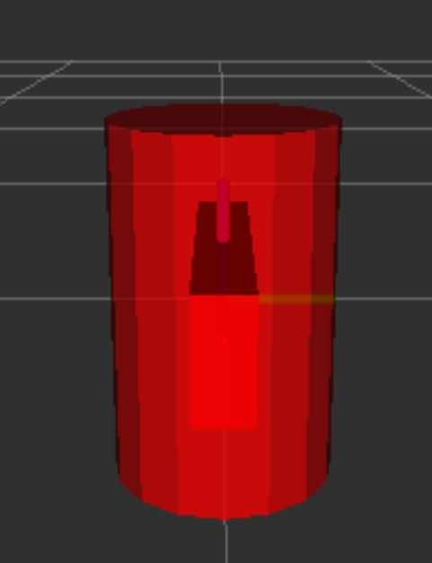
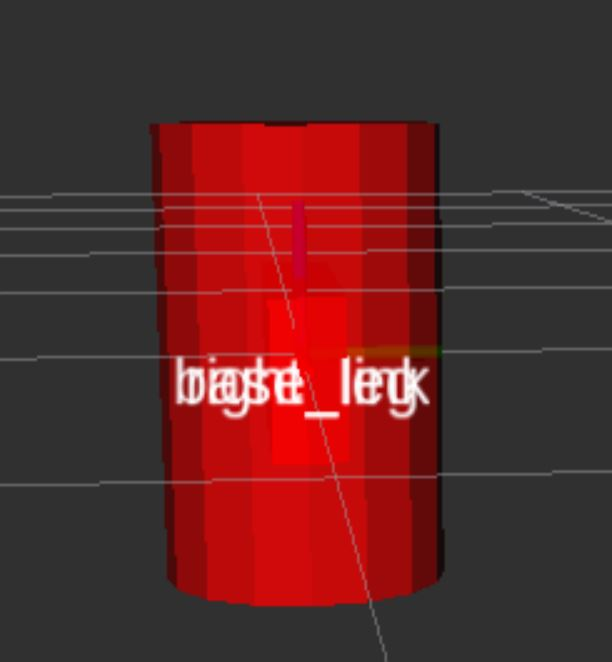
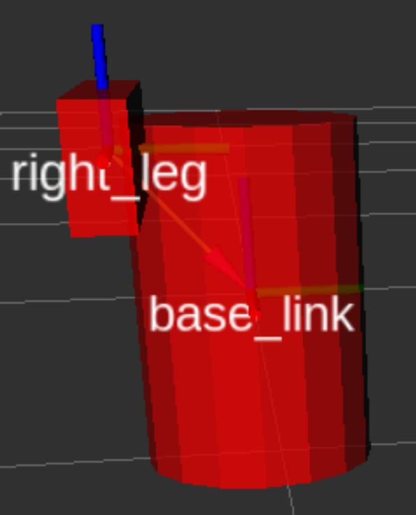
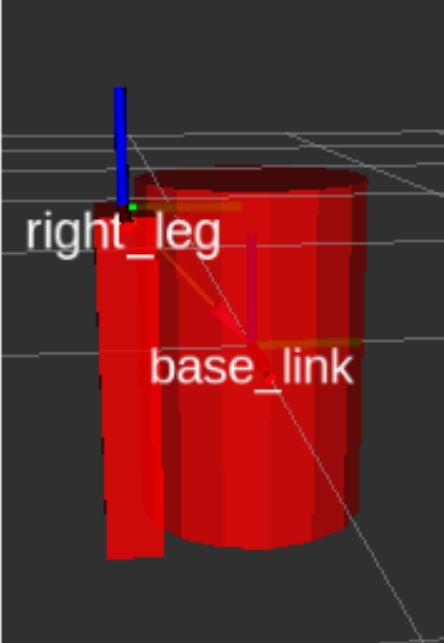
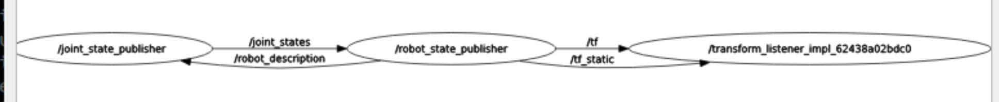

sudo apt install ros-humble-urdf-launch
sudo apt install ros-humble-joint-state-publisher

display.launch.py actually runs the two launch files under /opt/ros/humble/share/urdf_launch/launch

## First Example

在URDF (Universal Robot Description Format) 中，`<robot>` 元素定义了一个或多个相互连接的`<link>`元素以及它们之间的`<joint>`元素。每个`<link>`代表机器人的一个部件，可以有自己的形状、尺寸、质量和惯性属性。在给出的URDF片段中，定义了一个名为`base_link`的单独`<link>`，该`<link>`具有一个视觉（`<visual>`）元素，该元素描述了`<link>`的可视化表示方式。

这段URDF定义了一个名为`myfirst`的机器人，它只有一个名为`base_link`的链接。这个`<link>`包含一个视觉元素，表示为一个圆柱体，圆柱体的长度为0.6米，半径为0.2米。

在RViz或其他可视化工具中，`fixed frame`是一个参考坐标系，其他所有元素都是相对于它定位的。在此示例中，`base_link`作为唯一的`<link>`，自然被用作`fixed frame`。这意味着它是场景中所有变换和定位的参考点。

关于圆柱体的可视化和它相对于网格的位置，以下几点值得注意：

1. **圆柱体的原点**：在URDF中定义的视觉元素（在这个例子中是一个圆柱体）默认情况下其原点位于其几何中心。这意味着圆柱体的中心（长度上的中点）位于其原点。

2. **圆柱体相对于网格的位置**：由于圆柱体的原点（也是`base_link`的原点）位于圆柱体的中心，而这个原点又被用作RViz中的`fixed frame`的中心，所以圆柱体的一半会位于这个网格（假设网格在原点）的上方，另一半位于网格的下方。这是因为圆柱体的原点位于其几何中心，而这个原点恰好位于`fixed frame`的中心。

这样的表示方法使得在可视化和理解机器人模型及其组件在空间中的相对位置时更加直观。如果你在RViz中查看这个模型，你会看到圆柱体一半在地面（网格）上方，另一半在地面下方，因为它的中心与`fixed frame`的中心对齐。

## Second Example

If not set origin in joints, the origin of base_link and right_leg are overlapping

## Third Example

After first specifying the joint origin (relation of base_link and right leg), we have:

/tf is published by robot_state_pub:
transforms:
- header:
    stamp:
      sec: 1710813026
      nanosec: 603252645
    frame_id: base_link
  child_frame_id: right_leg
  transform:
    translation:
      x: 0.0
      y: -0.22
      z: 0.25
    rotation:
      x: 0.0
      y: 0.0
      z: 0.0
      w: 1.0
---

Now, looking at the leg’s visual origin, it has both a xyz and rpy offset. This defines where the center of the visual element should be, relative to its origin. Since we want the leg to attach at the top, we offset the origin down by setting the z offset to be -0.3 meters. And since we want the long part of the leg to be parallel to the z axis, we rotate the visual part PI/2 around the Y axis.

1. The launch file runs packages that will create TF frames for each link in your model based on your URDF. Rviz uses this information to figure out where to display each shape.

2. If a TF frame does not exist for a given URDF link, then it will be placed at the origin in white (ref. related question).
So YOU MUST HAVE BASE_LINK IN YOUR URDF:

在ROS (Robot Operating System) 中，TF (Transform) 是一种维护不同坐标系之间关系的系统。它允许你跟踪随时间变化的坐标系之间的相对位置和方向。每个坐标系被称为一个“frame”。

当你在RViz中可视化一个URDF模型时，每个`<link>`通常都会有一个与之对应的TF frame。这样，每个部件（或link）的位置和方向都可以相对于其他部件（或全局参考frame，如`base_link`）来确定。这对于理解机器人各部件如何相互关联及其在空间中的相对位置非常有用。

然而，如果某个URDF链接（link）**没有**对应的TF frame（也就是说，没有为这个链接定义相对于其他链接的变换），RViz将无法确定它应该在哪里放置这个链接的可视化表示。在这种情况下，RViz的默认行为是将该链接放置在原点（0, 0, 0），并通常以白色显示，以表明它没有有效的TF frame。

这种处理方式有几个目的：

1. **提示**：通过将没有TF frame的链接放置在原点并以白色显示，向用户提示这些链接缺少有效的TF信息。这是一种视觉提示，表明需要进一步配置或调查为什么这些链接没有与之关联的TF frame。

2. **容错**：即使缺少TF信息，也允许URDF模型的其余部分被可视化。这使得用户可以至少看到模型的一部分，并开始调试或修复缺少TF frame的问题。

3. **简化处理**：在缺少详细信息的情况下，将链接放置在原点并以一种默认颜色显示，提供了一种简单的方法来处理不完整的TF树情况，避免了可视化过程中的复杂错误处理。

理解这一点对于ROS新手至关重要，因为它有助于诊断模型配置问题，特别是在复杂机器人模型的开发和调试过程中。当你在RViz中看到位于原点且为白色的链接时，这是一个明确的指示，表明你需要为这些链接定义适当的TF变换。

So, in 03a-debug.urdf, you must specify the base_link

## Fifth Example

ros2 run tf2_ros tf2_echo base_link right_tip

## Sixth Example

prismatic's limit tag has unit of meters. Revoluate's limit tag has unit of radians

How GUI controls RVIZ?
GUI parse URDF and finds all nonfixed joints and their limits, it uses slider value to publish sensor_msgs/msg/JointState msgs. robot_state_pub use these msgs to calcuate tfs. tfs then show in RVIZ.

nodes relation

## Seventh Example

In many cases, you’ll want the collision geometry and origin to be exactly the same as the visual geometry and origin. However, there are two main cases where you wouldn’t:

1. Quicker Processing. Doing collision detection for two meshes is a lot more computational complex than for two simple geometries. Hence, you may want to replace the meshes with simpler geometries in the collision element. Otherwise it's gonna be very slow

2. Safe Zones. You may want to restrict movement close to sensitive equipment. For instance, if we didn’t want anything to collide with R2D2’s head, we might define the collision geometry to be a cylinder encasing his head to prevent anything from getting too close to his head.

Moment of Inertia Understanding:

1. If unsure what to put, a matrix with ixx/iyy/izz=1e-3 or smaller is often a reasonable default for a mid-sized link (it corresponds to a box of 0.1 m side length with a mass of 0.6 kg). The identity matrix is a particularly bad choice, since it is often much too high (it corresponds to a box of 0.1 m side length with a mass of 600 kg!).

2. You can also specify an origin tag to specify the center of gravity and the inertial reference frame (relative to the link’s reference frame).

3. When using realtime controllers, inertia elements of zero (or almost zero) can cause the robot model to collapse without warning, and all links will appear with their origins coinciding with the world origin.